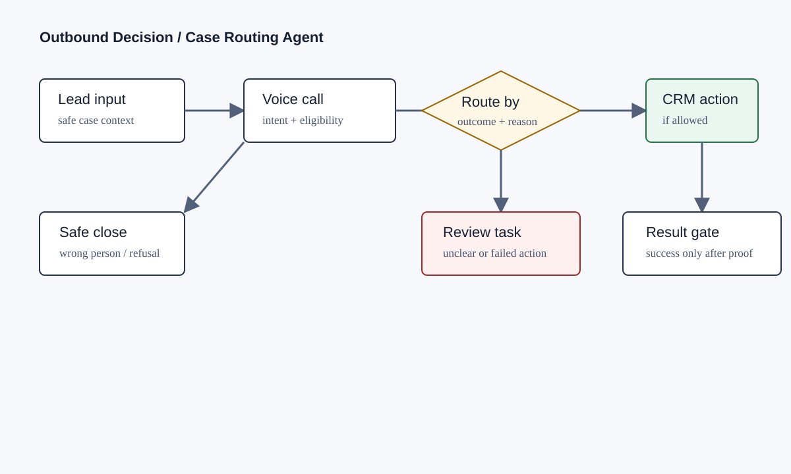
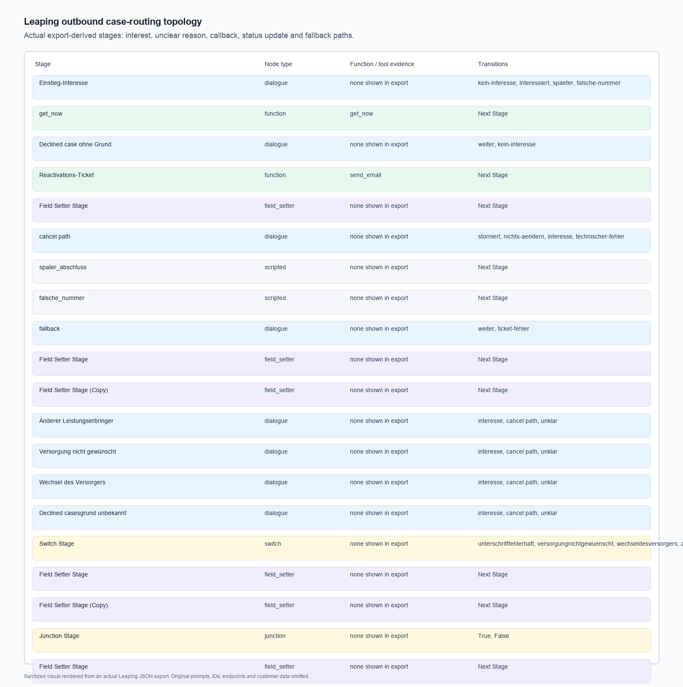
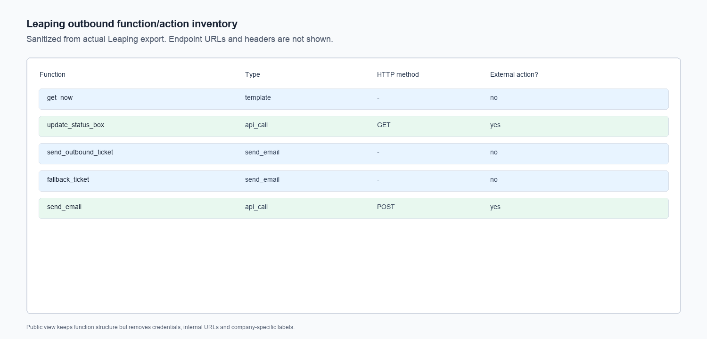

# Voice Agent Outbound Case Routing

Public-safe case study of an outbound Leaping voice-agent workflow for reactivation and case routing.

This repo is not meant to show “an AI chatbot.” It shows the system work around a voice model: branching, state, CRM/action reliability, fallback tickets, and the rule that the agent may only claim success after a real backend action succeeds.



## What This Proves

I built the outbound agent as a new workflow around rejected or declined cases. The important engineering problem was separating three things that sound similar in conversation but require different system behavior:

- historical rejection reason
- current customer interest
- confirmed operational action

The Leaping workflow had to handle interest, refusal, call-later, wrong number, unclear rejection reason, cancellation confirmation, action success/failure, and ticket fallback without collapsing them into one generic follow-up path.

## My Work

- Designed the outcome model for outbound reactivation calls.
- Built branch routing for interest, refusal, later callback, wrong number, no answer, third-party handling, and ambiguous rejection reasons.
- Connected structured Leaping fields to deterministic function/action stages.
- Added fallback review/ticket paths when automation could not safely complete.
- Kept success wording gated on action proof instead of conversational agreement.
- Rolled back over-controlled prompt versions when the agent became too long and questionnaire-like, then reintroduced only the safety improvements.

## Evidence Included



Export-derived topology from real Leaping JSON: opening branch, rejection-reason routing, switch logic, field setters, callback/wrong-number exits, action stage, and fallback paths.



Sanitized function inventory showing time helper, status/action update, outbound ticket/fallback paths, and API-backed notification behavior. Endpoints, headers, IDs, and customer data are removed.

More detail:

- [Implementation notes](docs/implementation-notes.md)
- [Evidence audit](docs/evidence-audit.md)
- [Flow notes](docs/flow.md)

## Public Reconstruction

The source code in this repo is a small reconstruction of the routing controller behind the case study. It uses fictional examples to demonstrate the reliability rule:

```json
{
  "conversationOutcome": "corrected_by_customer",
  "customerConfirmedAction": true,
  "actionResult": "success"
}
```

Only then can the output become:

```json
{
  "route": "repair_rejected_case",
  "status": "ready_for_resubmission",
  "usecaseSuccessful": true
}
```

If the action fails, the reconstructed system creates a review task instead of marking the call successful.

## Run The Tests

```bash
npm test
```

The tests cover successful repair, action failure, and caller refusal.

## Privacy

This public version does not include original Leaping exports, prompts, endpoints, credentials, recordings, transcripts, company names, customer records, real call IDs, or real CRM data. Screenshots and examples are sanitized or reconstructed from real workflow structure.
