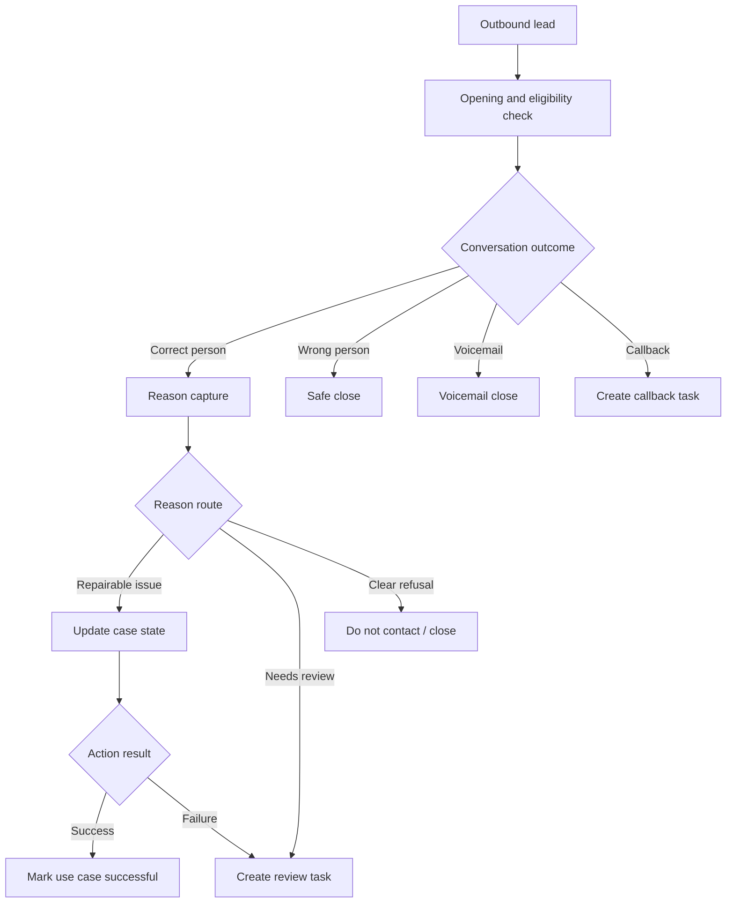

# Architecture

This repository reconstructs the outbound declined-case system as a neutral case study.

## Private Evidence Used

- Local voice-agent workflow exports showing dialogue, switch, field-setter, function, scripted, and terminal stages.
- Local notes describing outbound reactivation/rejection handling and strict success-after-function behavior.
- Function inventory showing state update and fallback ticket/email actions.

## Sanitization

Excluded from this public reconstruction:

- Original workflow JSON exports
- Production endpoints and authorization headers
- Company names, customer data, call IDs, phone numbers, and transcripts
- Original prompts and internal business wording
